## Description

This group project was completed in Week 9 of the General Assembly Software Engineering Immersive course. The project brief was to build a full-stack MERN application. Our group identified a pain point (deciding which film to watch with someone is boring!) and worked on a solution. Our app lets the user select films they would want to watch. We add this information to our database. The user selects who they are watching with. We use both users’ data to present a film that we know both users will be happy to watch. The end result was our app, Watch It!
 
## Deployment link

https://sei-project3-moviematch.netlify.app

## Overview

## Timeframe & Working Team (Solo/Pair/Group)

Group Project - with Milly (github.com/millyarkwright) and Alex (github.com/hal-alex)

1 Week Deadline

## Technologies Used
### Back-end:
Node.js
Mongodb
Express
Bcrypt
Body-parser
Mongoose
jsonwebtoken
### Frontend:
React
Axios
SCSS
Http-proxy-middleware
Nodemon
React Router Dom
React Bootstrap
### Development tools:
VS code
NPM
Insomnia
Git
Github
Google Chrome dev tools
Excalidraw
Heroku 
Netlify
Trello Board 

## Brief

Build a full-stack application by making your own back-end and your own front-end
Use an Express API to serve your data from a Mongo database
Consume your API with a separate front-end built with React
Be a complete product which most likely means multiple relationships and CRUD functionality for at least a couple of models
Implement thoughtful user stories/wireframes that are significant enough to help you know which features are core MVP and which you can cut
Be deployed online so it’s publicly accessible.

## Planning

### Front End:

After agreeing on our idea we planned our front end on Excalidraw. We aimed to keep the user journey as intuitive and simple as possible using ‘useNavigate’ to automatically direct our user throughout our app. As a stretch target we wanted to include a feature where you could only match with your friends (mostly because we were keen to learn how to implement a friend system.)

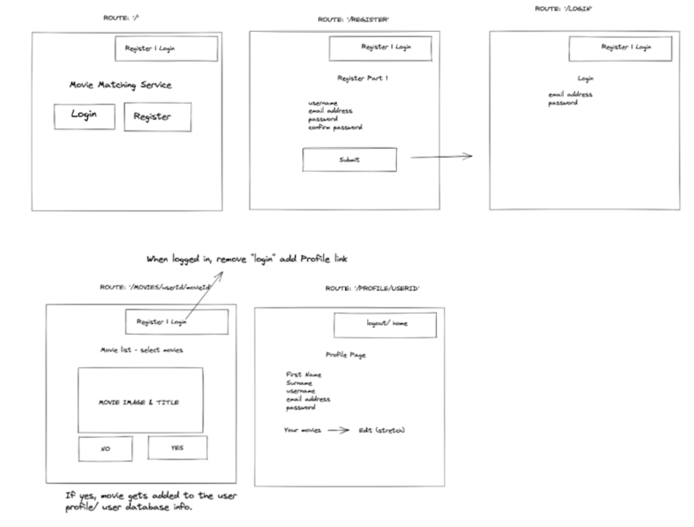
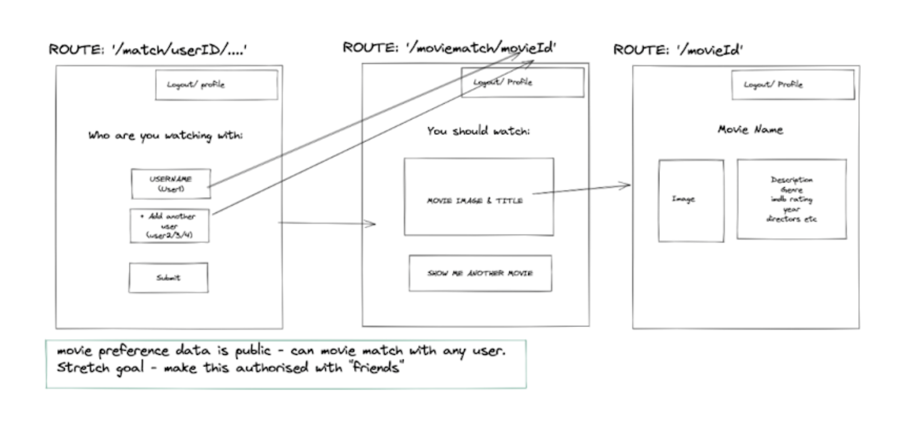
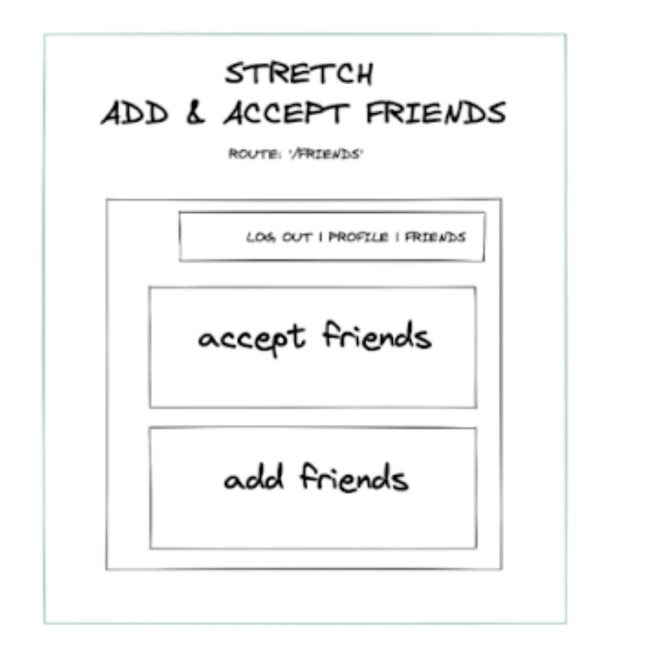

### Back End:

For our frontend to work, our backend needed routes, controllers, models, and an auth and error handler in our middleware. 

We planned to have two models, users and movies. 

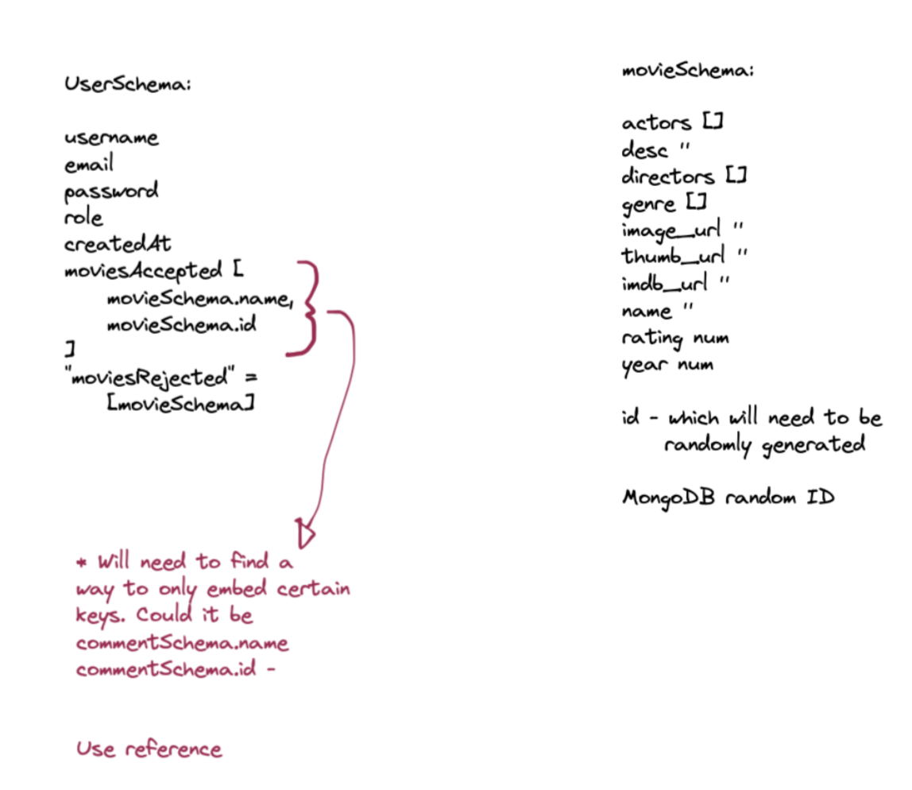

### Development:

We planned to work collaboratively, using VSCode’s liveshare to collectively problem-solve. We also planned our time on Trello. Our plan was to create an MVP and then add stretch targets with ‘nice to have’ features.

## Build/Code Process

Having spent so much of the General Assembly course completing daily homeworks alone, my favourite aspect of the projects was the opportunity to collaborate, share ideas and learn from others. In this spirit, we agreed that pair coding, using VSCode’s live share feature, was how we wanted to work for the entire project.

As this was a one week project, there was a lot of code written. Our app includes a login and register page, a page for changing a user’s password, a page for swiping on movies you would want to watch, a page with additional movie information and a page for matching your liked movies with other users. For the purposes of this ReadMe, instead of giving a shallow overview of many features, I am going to focus on one feature - Movie Swipe. I have chosen this feature because this component features examples of problem-solving, logic and using what we had been taught to create something new.

Our Movie Swipe feature needed:

- A list of movies to swipe
- A function to filter movies the user had already swiped
- A way to connect to our back end and send a put request

### A list of movies to swipe

We found a list of the top 250 movies on GitHub (https://github.com/movie-monk-b0t/top250) which were in JSON format and we seeded this data. This, immediately, had the benefit of making our app feel full and also meant that users would be given the same options of films to swipe. One concern we had was that, with a large database, users might swipe loads of films and still have no matches with other users. By presenting the films in order, it was likely that, with only a few swipes, we would be able to provide a match.

### A function to filter movies the user had already swiped

On page load, in our front end, we ran a get request to get the user data and set our user data to the data received from this request.

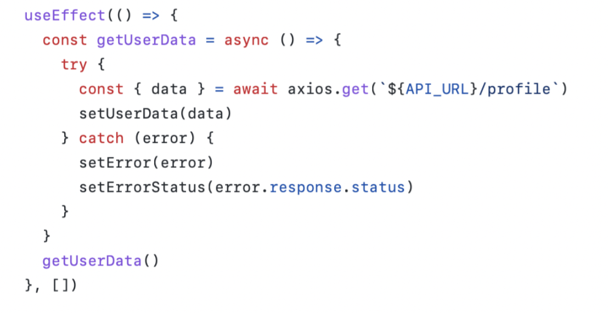

In our back end, our user controller meant we pulled the data from the user currently logged in, and provided an error message if the current user could not be found. Whilst, we had a feature on our front end to prevent this page being accessible unless our user was logged in, we included this error handler in case we had further updates.

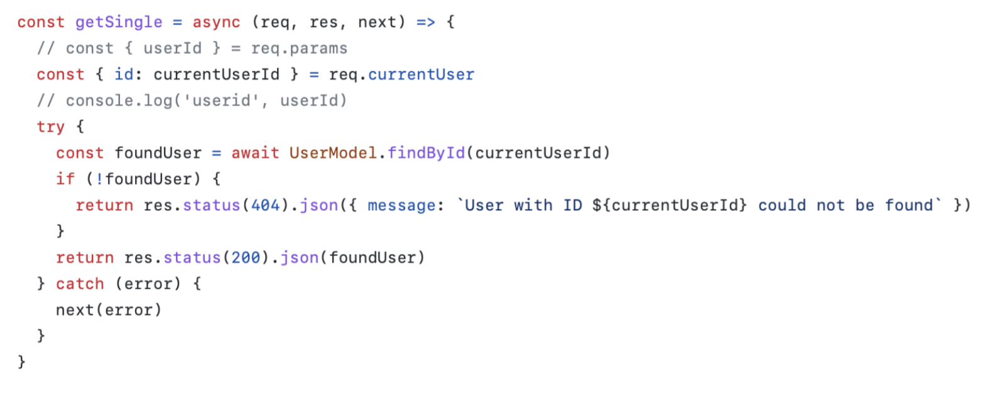
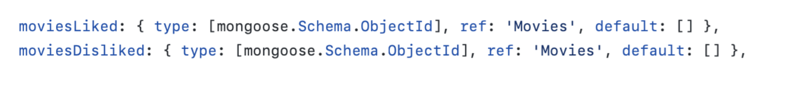

The following useEffect ran only once we had pulled our user data. We pulled all movies from our database using a get request. We then filtered the data using the filter array method. We created two new constants called ‘movieAlreadyLiked’ and ‘movieAlreadyDisliked’ which checked if the ID of the movie from the pulled movies matched any values in the users’ ‘moviesLiked’/ ‘moviesDisliked’ object. If there were no matches it was given a falsey value and the value was only returned if neither ‘movieAlreadyLiked’ or ‘movieAlreadyDisliked’ were truthy. 

We had a separate const called ‘filteredData’ which was an array of all of the movie IDs, which we could then use to make get requests to get all the data we needed from each single movie. 

We then set ‘allMovies’ to ‘filteredData’. This meant the user was presented with an array of films they had not yet been shown and could pick up where they left off each time they logged in. 

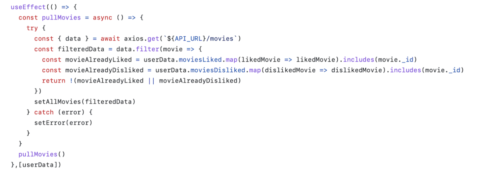

As this was our first time working with a MERN full stack app, and as we had only been taught it a week previous, it was perhaps inevitable that our code would have a few mistakes. In writing this ReadMe, I have noticed that the map function used in movieAlreadyLiked and Disliked is redundant. I am fairly confident the app would be just as functional written as:

const movieAlreadyLiked = userData.moviesLiked.includes(movie._id)

Whilst it isn’t a bug that breaks our app, it isn’t ‘DRY’ coding and in a future update I would like to fix this.

### A way to connect to our back end and send a put request

With allMovies set as our filtered movies array, we know that unless our user has swiped on every movie, they will be presented with the first value in our array. This means that on page load, the user will always be swiping on allMovies[0]. Our function sends a put request, updating our moviesLiked or moviesDisliked list depending on which button the user clicked. 

Once the user has selected like or dislike, we show the next film in the array, and our count (which starts at 0) is updated by 1.

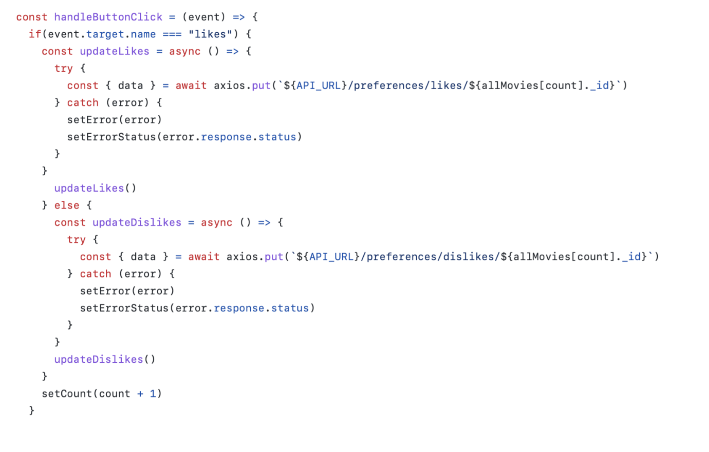

Our backend works by pushing the movie ID to our moviesLiked or moviesDisliked object.

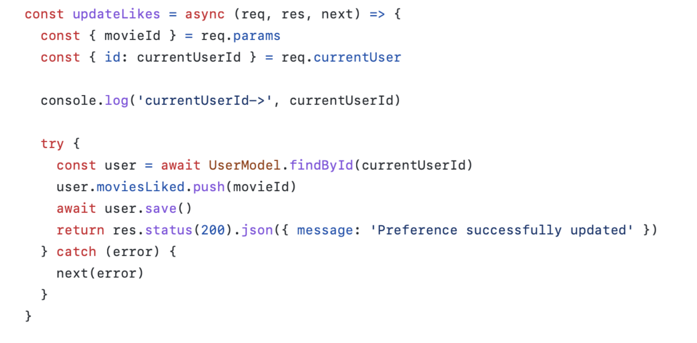
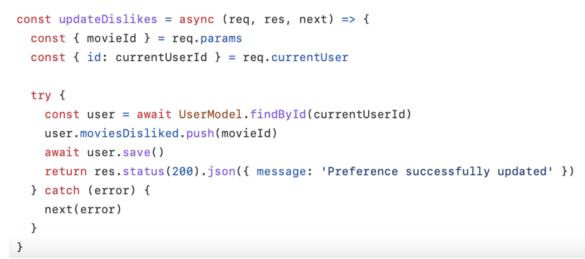

## Challenges

At the start of the General Assembly course, I was nervous to use the terminal at all and really nervous about using GitHub. As the weeks passed, I grew more and more confident in running Git Add, Git Commit and Git Push. To retrieve my classwork, I’d happily run Git Pull everyday and at the start of my projects, I knew to run Git Init. This meant that by Week 9 of the course, and knowing five different commands, I considered myself to be an expert in Git. I was wrong.

Working over three different computers on the same project meant we had to learn how to deal with merge conflicts, we learnt to work on different branches and we learnt the hard way to never, ever make changes whilst on the main branch. 

This project showed me that, even in the topics I thought I knew well, there is so much more to learn. I am looking forward to continuing learning new applications and features in the languages I am learning. 

## Wins

The biggest win was seeing our idea go from a plan in Excalidraw and on Trello into a functioning app - in just one week. Before the course, I would always come up with ideas for websites but not be able to do anything with them. This was the first time I was able to turn an idea into something tangible and it showed how much I had learnt after just two months. The app was useful, was a solution to a pain point and worked smoothly with minimal bugs. 

## Key Learnings/Takeaways

This project was my first time creating an API, working with a back end, working in a larger group (over Git) and we went beyond what we had learnt in the course by adding a “match” feature which meant using logic to find new ways of applying practical uses of our database. 

I am much more confident creating apps using the MERN stack. While I was already confident working with the front end (having already done so successfully in project 2) I was able to develop my conceptual understanding of how all parts of our projects linked together. Using Excalidraw diagrams provided during our lessons in the week prior, I expanded my knowledge of request flow, database design, environment variables, seeding, secrets, error handlers and authentication. 

## Bugs

If you refresh the page, you’re logged out. 
We added a “page not found” component, which is supposed to display if the user ends up on a route we hadn’t created, however, it only seems to work some of the time.

## Future Improvements

The main change I would like to make is to change a fundamental part of our logic. Getting all users and their likes works now, at a small scale as a proof of concept, but it is too clunky a way for the app to work long-term, especially if it grows. Instead in the back end there should be a controller, which checks if the user selected exists and then gets all of our selected users likes. At the moment this is done in the front end. 

Other changes I would like to add would be to implement the ideas in our plan. This includes an intermediary page between /match and /movieId where if users aren’t happy with the match they have the option to be shown another film. 

Another feature to add would be a dynamic form which would allow the user to match with multiple users - this would allow groups of people to settle on a film. 
A final feature I would like to add would be to group the films into smaller arrays (films 1-10 in one array, 11-20 in another etc). This way, by randomising each array in order, we could randomise the films we show to users whilst still making it likely for users to have a match. This would make the experience feel more personalised without compromising on the end product. 

Initially we wanted to add a friend feature because it was something we were keen to learn. Looking at similar movie apps (for example https://letterboxd.com), the list of movies users like are always public and so actually a ‘friends’ feature, perhaps, wasn’t appropriate for this app. I would still be keen to learn how to add a ‘ friends’ feature in a MERN app, however, it would perhaps be better to apply it to another project. 

